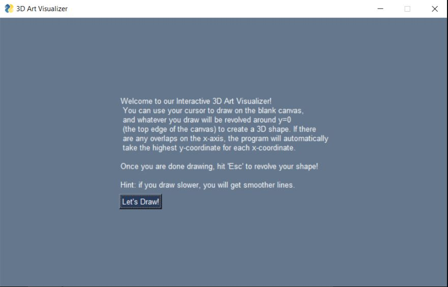
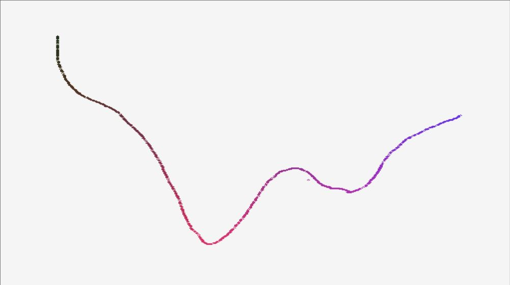
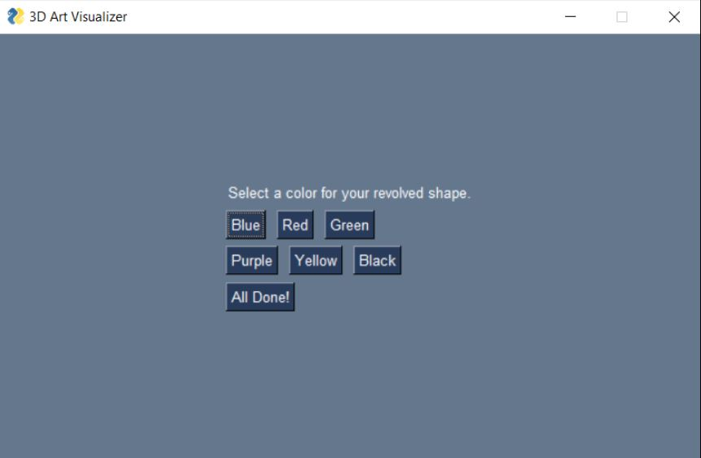
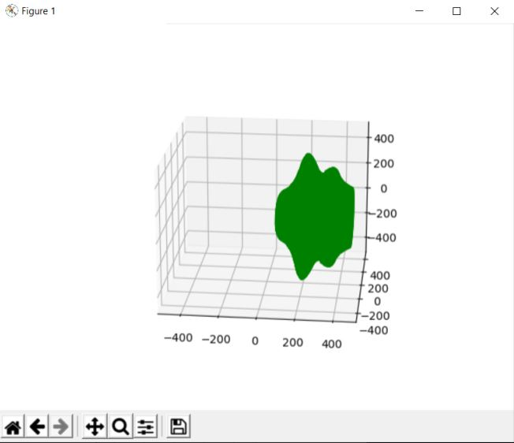

The interactive art visualizer turns 2D shapes drawn by the user (that's you!) with a mouse into 3D revolved shapes. When you run the progam, a draw window opens where the left mouse button can be pressed or held and dragged to draw on the screen. The slower the drawing is made, the more accurate the 3D-shape will come out.

 

### How Does it Work?
Whatever you draw with your mouse on the draw window will be revolved around the x axis (top edge of the window) to create a beautiful 3D shape! If there are any holes/gaps in your drawing in the x-axis direction, they will be automatically filled in through linear interpolation to create a continuous curve. When there are multiple points with the same x-value the highest y-value will be used when revolving the shape. When you are done drawing and are ready to see the revolved version of your masterpiece, press the 
escape key, which will open up a color picking window. 



From here, you can select from a variety of colors, and a beautiful shape is created!



To access our Interactive 3D Art program on GitHub, you can check out our [project repository here](https://github.com/olincollege/Interactive-Art-Visualizer).

### Installation
To be able to run our program, the following libraries must be installed.

OpenCV
```markdown
pip install opencv-python
```
NumPy
```markdown
pip install numpy
```
MatPlotLib
```markdown
pip install matplotlib
```
PySimpleGUI
```markdown
pip install pip install PySimpleGUI
```

The 'pip' command can be used in a command window to install the libraries. If there are issues with installing the libraries, try "python -m pip install (library name here)" instead.

To run the program, execute the `main.py file`. There are no necessary changes to run the code, other than installing the libraries.

## Example Stuff

You can use the [editor on GitHub](https://github.com/schung114/interactive-3D-art-visualizer.softdes.io/edit/gh-pages/index.md) to maintain and preview the content for your website in Markdown files.

Whenever you commit to this repository, GitHub Pages will run [Jekyll](https://jekyllrb.com/) to rebuild the pages in your site, from the content in your Markdown files.

### Markdown

Markdown is a lightweight and easy-to-use syntax for styling your writing. It includes conventions for

```markdown
Syntax highlighted code block

# Header 1
## Header 2
### Header 3

- Bulleted
- List

1. Numbered
2. List

**Bold** and _Italic_ and `Code` text

[Link](url) and 
```

For more details see [GitHub Flavored Markdown](https://guides.github.com/features/mastering-markdown/).

### Jekyll Themes

Your Pages site will use the layout and styles from the Jekyll theme you have selected in your [repository settings](https://github.com/schung114/interactive-3D-art-visualizer.softdes.io/settings/pages). The name of this theme is saved in the Jekyll `_config.yml` configuration file.

### Support or Contact

Having trouble with Pages? Check out our [documentation](https://docs.github.com/categories/github-pages-basics/) or [contact support](https://support.github.com/contact) and we’ll help you sort it out.
